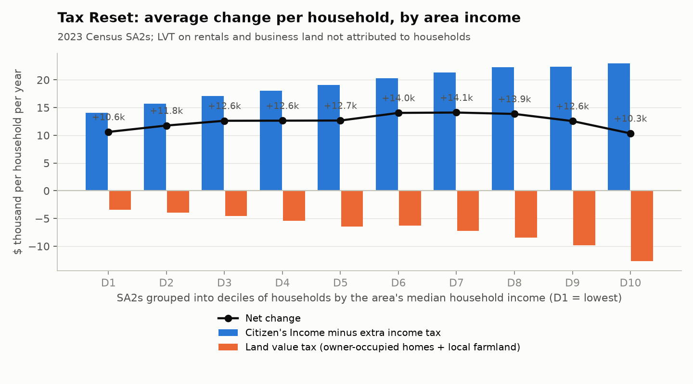
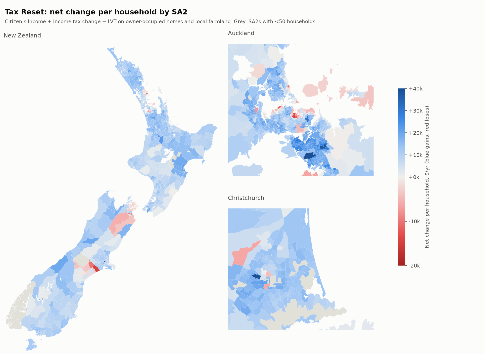
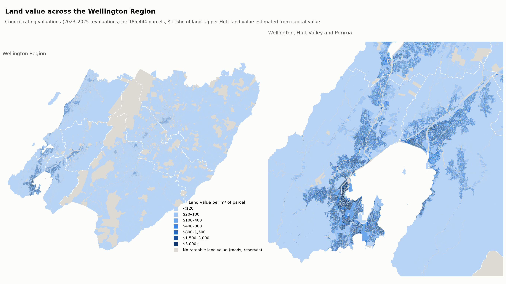

# National model: The Opportunity Party's 2026 Tax Reset

An area-level model of The Opportunity Party's (TOP) 2026 "Tax Reset" across all of
New Zealand. It covers:
- a land value tax (LVT) of 1.75% a year on urban land and 0.5% on rural land;
- a tax-free Citizen's Income of $19,400 a year for residents 18 and over;
- income tax brackets of 28%, 34% and 39%.

Land values come from about 2 million rating units harvested from public council map
layers. Incomes, tenure and households come from the 2023 Census at SA2 level.

> **Status: first pass.** This is an area-level approximation, not a household
> microsimulation. Read [What this can and can't tell you](#what-this-can-and-cant-tell-you)
> before quoting numbers.

## Headline results

**Land value and the land value tax**

| | $bn / year |
|---|---|
| Land value, all 67 councils (57 harvested, 10 imputed) | **1,582** |
| Stats NZ non-produced assets (mostly land), March 2024, as an independent check | 1,635 |
| **LVT revenue** after exemptions (conservation, government, non-profit land) | **20.8** |
| TOP's claimed LVT revenue | 24.3 |
| — paid by owner-occupiers | 10.8 |
| — paid by farm land | 1.4 |
| — paid by landlords, businesses and others (not placed in any SA2) | 8.7 |

**Citizen's Income and income tax**

| | $bn / year |
|---|---|
| Citizen's Income paid to 2.6m working-age adults not on NZ Super or a replaced benefit | 50.6 |
| Extra income tax from the 28/34/39 scale | −16.2 |
| **Net income-side cost** | **34.4** |

**Fiscal balance**

| | $bn / year |
|---|---|
| LVT revenue + TOP's claimed $1.7bn admin savings − income-side cost | **−11.9** |

- **The package doesn't balance under these assumptions.** TOP says the LVT pays for the
  Citizen's Income with about $4bn to spare. This model finds a gap of about $8–14bn a
  year depending on assumptions
  ([`fiscal_sensitivity.csv`](outputs/tables/fiscal_sensitivity.csv)). The gap barely
  depends on income assumptions: the Citizen's Income is a flat payment, and TOP's scale
  raises roughly $7–8k more per earner above $50k. It depends mainly on how many adults
  qualify and on land tax revenue.
- **The land value tax is about 1.3% of all land value** once rural land (0.5%) and
  exemptions are allowed for. The total land value here is within 3% of Stats NZ's
  national balance-sheet figure, so the land side is well anchored.

### Who gains, by area income



SA2s are ranked by median household income and grouped into ten equal groups
(deciles) of households:

| Area income decile | Median household income | Citizen's Income − extra tax | LVT (owner-occupied + local farm) | Net per household | Net as % of income |
|---|---|---|---|---|---|
| D1 (lowest) | $56,500 | +$14,000 | −$3,400 | **+$10,600** | 19% |
| D5 | $93,000 | +$19,100 | −$6,400 | **+$12,700** | 14% |
| D10 (highest) | $156,300 | +$23,000 | −$12,700 | **+$10,300** | 7% |

- **Higher-income areas get more from the Citizen's Income side** because they have more
  working-age adults per household and fewer superannuitants and beneficiaries. Those two
  groups are held harmless, so their net change is zero.
- **They also pay much more land tax** (about $12,000 per household in D10 against $3,000
  in D1).
- The result is a roughly flat dollar gain across areas, which is strongly progressive
  as a share of income.
- 97% of households live in SA2s with a net average gain. The median SA2 gains about
  $12,700 per household a year (10th–90th percentile: $6,000–$18,600).

**How to read these levels:** households in the model gain about $22bn in total. That is
roughly the $11.9bn fiscal gap plus the $8.7bn of land tax on rentals and businesses
that can't be placed in an SA2. Someone has to pay both: future taxpayers or spending
cuts for the gap, and landlords, business owners and shareholders for the unplaced land
tax. Spread evenly, they would take about $11,500 off the average household. **The shape
across areas is more reliable than the level.**



Other patterns:
- **Farming districts gain least** (Ashburton, Hurunui, South Wairarapa, Western Bay of
  Plenty), because farmland at 0.5% is charged to the relatively few households there.
- **High-value holiday areas also gain little** (Thames-Coromandel), because owner land
  tax is high relative to working-age incomes.
- **Lower-value cities with many working-age households gain most** (Porirua, Hastings,
  Hamilton, Lower Hutt). Wellington City sits near the top too: its high incomes mean the
  Citizen's Income side outweighs its land tax.
- By council: [`net_change_by_ta.csv`](outputs/tables/net_change_by_ta.csv). Every SA2:
  [`sa2_results.csv`](outputs/tables/sa2_results.csv).

## Regional land value map: Wellington Region

[`scripts/map_region.py`](scripts/map_region.py) re-downloads the region's council layers
with parcel shapes. It spreads each rating unit's land value over its parcels (a farm
split across several parcels, or unit titles sharing one) and maps land value per m² for
185,000 parcels ($115bn of land across the region's eight councils).



| Council | Land value | Average $/m² of private land |
|---|---|---|
| Wellington City | $51.0bn | $180 |
| Lower Hutt | $19.5bn | $51 |
| Kāpiti Coast | $13.5bn | $18 |
| Porirua | $10.0bn | $63 |
| Upper Hutt (land value estimated from capital value) | $7.4bn | $13 |
| Masterton | $5.8bn | $2.8 |
| South Wairarapa | $5.2bn | $2.8 |
| Carterton | $2.5bn | $3.3 |

Averages per m² are pulled down heavily by large rural parcels. Median urban
residential land is roughly $400–1,600/m².

## Policy parameters

Parameters are in [`scripts/policy.py`](scripts/policy.py). TOP's own
[Tax Reset page](https://www.opportunity.org.nz/tax-reset) confirms:
- the 1.75% urban LVT and 0.5% for farmers;
- the $19,400 Citizen's Income, paid weekly, for residents 18+;
- the 28/34/39% brackets;
- superannuitants and current beneficiaries held harmless;
- retirees able to defer the LVT.

Other parameters:
- **Bracket thresholds ($50k / $200k)** come from secondary sources (Deloitte, Johnston
  Law, interest.co.nz). TOP's full policy PDF wasn't retrievable.
- **Exemptions** (conservation, government, club/religious, Treaty settlement, communal
  Māori land, social housing) come from Deloitte and Johnston Law.
- **Current tax** is the IRD schedule from 31 July 2024 plus the Independent Earner Tax
  Credit.

## Data

| Source | What | Coverage |
|---|---|---|
| 26 council and regional-council ArcGIS layers ([`harvest_land.py`](scripts/harvest_land.py)) | Land and capital value per rating unit; category where published | 57 of 67 councils, 2.01M of 2.28M rating units, most councils ≥ 90% of LINZ's count ([`ta_land_value_and_lvt.csv`](outputs/tables/ta_land_value_and_lvt.csv)) |
| LINZ NZ Property Boundaries | Official rating-unit counts per council | Coverage check, imputation |
| Stats NZ 2023 Census, SA2 ([`fetch_census.py`](scripts/fetch_census.py)) | Personal income bands, income sources, age, household income, tenure, rent | All 2,395 SA2s; 4.99M residents, 1.78M households |
| Stats NZ SA2, urban–rural, TA boundaries | Geography | National |
| DOC Public Conservation Land | Exempt land | National |
| Stats NZ annual balance sheets 2024 | Land held by government and non-profits (exemption proxy); national total check | National |

**No public layer found for:** Far North, Kaipara, Rotorua, Whakatāne, Kawerau, Napier,
Hastings, Wairoa, Nelson, Kaikōura and the Chatham Islands. Their totals ($128bn) are
imputed as LINZ rating units × the land value per unit of covered councils in the same
region. **Canterbury:** six districts only have 2021 values (ECan), scaled by 1.89× (the
growth observed in Selwyn and Waimakariri). **Upper Hutt:** publishes capital value only;
land value is imputed from Hutt City's land/capital value ratios.

LINZ's open valuation roll (table 114085) covers only about 12% of rating units and needs
a free API key. The full national roll is restricted to government agencies. With access
to it, the council harvest and every imputation could be replaced.

## Method

1. **Land** ([`build_land.py`](scripts/build_land.py)):
   - Deduplicate by valuation number: parcel-based layers repeat a farm on every parcel.
   - Assign each rating unit to a council, SA2 and urban–rural area by location.
   - **Rural** (0.5%) means a valuation category of farm, forestry, horticulture or
     lifestyle. Where a layer has no category, it means land in a Stats NZ "rural other"
     area.
   - **Residential** means category R or L. Without a category, it means a unit in a
     settled area whose capital value is 0.25–4× its SA2's median. On councils that do
     publish categories, this rule gets SA2 residential land value within a median 2.5%.
   - Units inside DOC conservation land are exempt.
2. **Incomes** ([`build_income.py`](scripts/build_income.py)):
   - Take out of each SA2's 15+ income bands: 15–17 year olds, NZ Super recipients and
     people on the benefits the Citizen's Income replaces (Jobseeker, Sole Parent,
     Supported Living, Student Allowance).
   - Everyone left gets $19,400 minus (TOP tax − current tax) at their band's mean
     income. The top band ($100k+) uses $165k.
3. **Households** ([`model_national.py`](scripts/model_national.py)):
   - **Owner-occupier land tax** = owner and family-trust households × the SA2's
     residential land value per rating unit × 1.75% (0.5% for the lifestyle share).
   - **Farmland tax** (0.5%) is charged to households in the same SA2.
   - **Renters pay no land tax.** Land taxes are not passed on to tenants except under
     pervasive rent control, which New Zealand doesn't have (see Doucet's
     *Five Years Later*).
   - **Land tax on rentals and business land** goes in the national ledger only.
   - For 402 SA2s with too few observed residential units (mostly the uncovered
     councils), residential land value per unit is imputed from census variables
     (R² = 0.60).

Reproduce:
```bash
pip install -r ../requirements.txt
python scripts/fetch_census.py    # census, boundaries, urban-rural, DOC land
python scripts/harvest_land.py    # ~2M rating units from 26 council layers (~10 min)
python scripts/build_land.py
python scripts/build_income.py
python scripts/model_national.py
```

## What this can and can't tell you

- **It works on areas, not households.**
  - Incomes are banded.
  - Benefit and Super recipients are removed from the bands by rule of thumb.
  - Everyone in an SA2 is treated as sharing the same average residential land value.
  - For household-level results (for example, how many households lose), use Stats NZ's
    IDI or Treasury's TAWA model.
- **The Citizen's Income top-ups aren't modelled.** These are the Child Support Income
  ($6,750–$18,250 per child), sole-parent, disability and regional housing top-ups, and
  their 10% abatement. TOP says families with children gain; this model doesn't capture
  that yet. KiwiSaver 2.0 contributions (up to 6% of pay) are savings and are left out.
- **Holding superannuitants and beneficiaries harmless means zero change for them,**
  except the land tax they pay as owner-occupiers. In reality superannuitants can defer
  that until sale, so their cash income is unchanged while their estate bears the cost.
- **2023 incomes are set against 2024–2026 land values.** Uprating incomes to 2026 moves
  the fiscal balance by only $0.4bn.
- **No behavioural or price effects are modelled.** TOP and Cotality expect land prices
  to fall 10–15%. That would lower the land tax base over time and reduce owners'
  wealth, but not their cash income. There's also no labour-supply response to the
  Citizen's Income.
- **Farmland tax is charged where the farm is.** In Mid and South Canterbury this is
  amplified by the scaled 2021 values.
