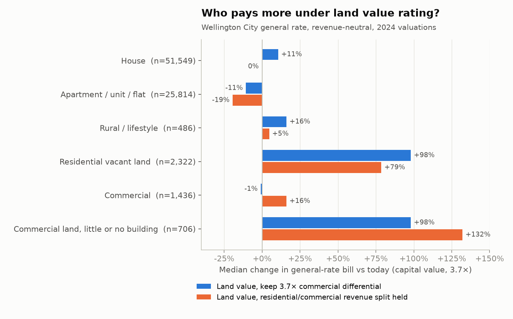
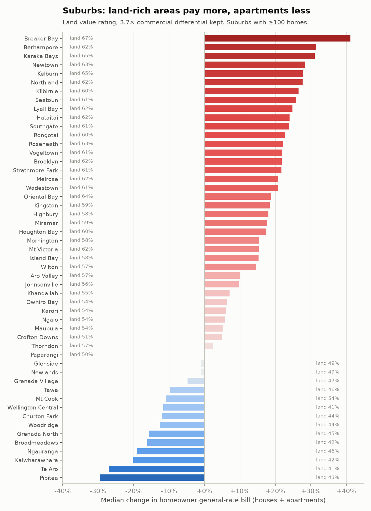
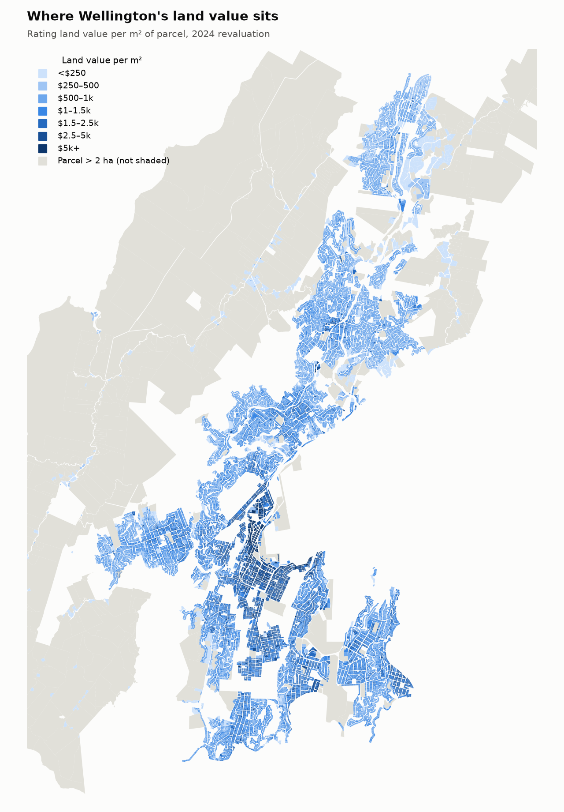
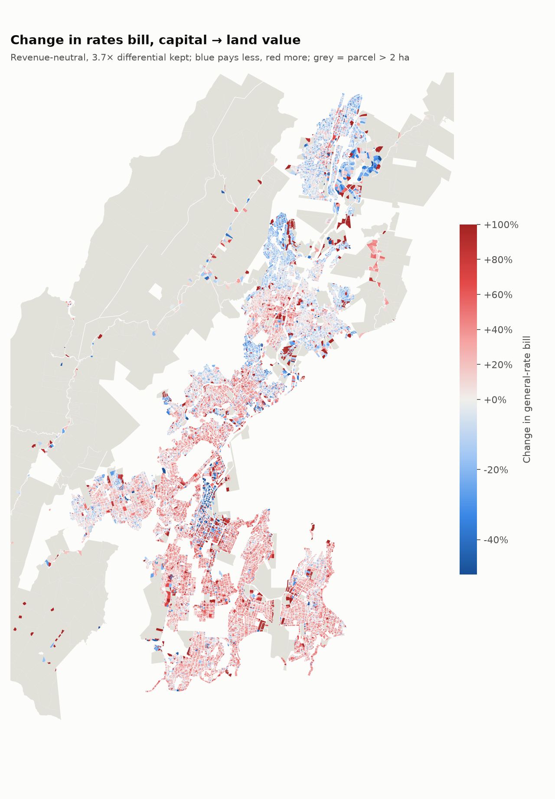
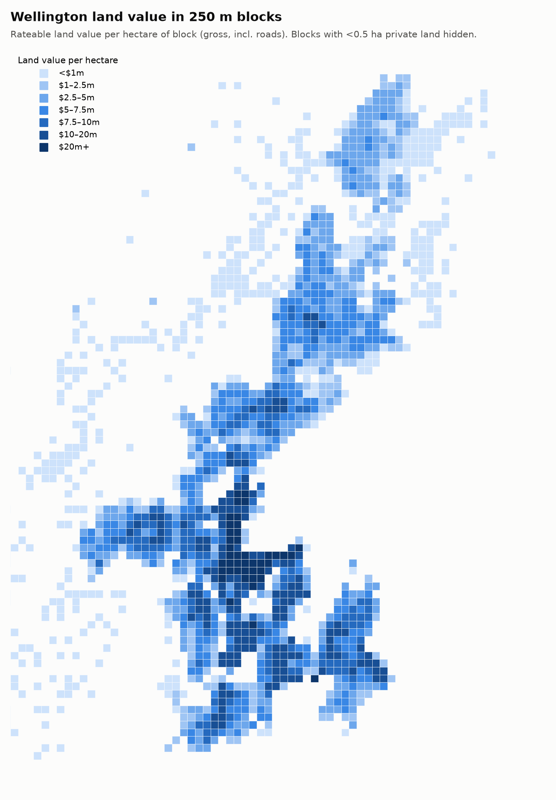
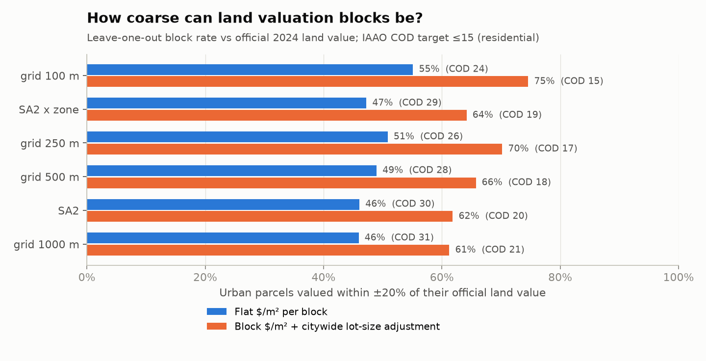

# Wellington City: what if rates were set on land value?

A parcel-level model of moving Wellington City Council's **general rate** from capital
value (CV) to land value (LV), using the council's own public valuation roll. It follows
the approach Lars Doucet and the Center for Land Economics use for US cities
([*Does Georgism Work? Five Years Later*](https://www.astralcodexten.com/p/does-georgism-work-five-years-later)),
adapted to New Zealand's rating system.

This matters now: in 2026 the council agreed to **consult on switching from capital value
to land value rating** (and on reducing its 3.7× commercial differential) for the
2027–37 Long-term Plan.

## Headline findings

All scenarios raise the same general-rate revenue as today (about **$396m** modelled on
82,313 rateable units). Targeted rates (water, sewerage, stormwater, downtown levy) are unchanged
and excluded.

| Scenario | Commercial share of general rate | Median house | Median apartment / unit | Vacant land & low-improvement sites |
|---|---|---|---|---|
| **Today**: CV, commercial pays 3.7× | 42.7% | $3,000 | $1,779 | $23.6m |
| LV, keep 3.7× | 36.4% | $3,315 (+11%) | $1,612 (−11%) | $46.5m |
| LV, residential/commercial revenue split held | 42.7% | $2,989 (0%) | $1,454 (−19%) | $52.3m |
| LV, differential cut to 2.0× | 23.6% | $3,981 | $1,936 | $34.7m |
| LV, no differential | 13.4% | $4,514 | $2,196 | $25.2m |
| CV, differential cut to 2.0× (for comparison) | 28.7% | $3,731 | $2,212 | $18.2m |

1. **Land is a big deal in Wellington.** Land is 54% of the rateable capital value
   ($48.6bn of $90.4bn), and 56% for residential property.
2. **Vacant land and land-banked sites roughly double their rates** under every LV
   scenario. The 706 commercial sites with little or no building (surface car parks,
   cleared lots, quake-prone buildings valued at nil) go from about $19m to $38m. This
   is the incentive Georgists want: holding well-located land empty gets more expensive.
3. **Apartments are the clearest winners.** They sit on small land shares, so their
   bills fall 11–19%. Te Aro and Pipitea homeowners see median falls of 27–30%.
4. **Older, land-rich suburbs pay more; newer northern suburbs pay less.** Houses in
   Newtown, Berhampore, Kelburn, Hataitai, Kilbirnie and Seatoun (land is over 60% of
   value) rise 24–31% under "LV, keep 3.7×". Churton Park, Tawa, Grenada North and
   Broadmeadows (land about 45%) fall 10–16%. The split follows each suburb's land share.
5. **Keeping the 3.7× commercial differential while moving to LV shifts about $25m
   a year from commercial ratepayers to residential ones.** Built commercial property
   pays $44m less and commercial land with little or no building pays $19m more.
   Commercial value is 43% land compared with 56% for residential, so taxing land cuts
   the commercial base. That is what pushes the median
   house up 11%. If the council holds each sector's revenue share constant instead, the
   median house is unchanged and 58% of homes pay less.
   **The rating base and the differential cannot be decided separately:** cutting the
   differential on top of an LV switch compounds the shift onto homeowners.
6. **This differs from the US results.** Doucet reports that the median single-family
   homeowner usually wins under a US land value tax shift. In Wellington the median
   house wins only if the commercial/residential split is held. Wellington already taxes
   commercial property heavily, and much of its housing is old, cheap-to-rebuild buildings
   on expensive land.
7. **The land values look fit for purpose.** Doucet's Baltimore report found vacant lots
   valued at about a tenth of the land value per m² of the improved lot next door.
   Wellington doesn't show that. Across 1,701 vacant lots compared with same-zone,
   similar-size improved neighbours within 300 m:
   - Vacant commercial land is valued at a median **1.01×** its neighbours' land $/m².
   - Vacant residential land is valued at 0.89× (many of those sections are steep or
     access-only).
   - Only 10% of vacant commercial lots fall below half their neighbours' rate.

## Figures





| | |
|---|---|
|  |  |

Tables behind every number are in [`outputs/tables/`](outputs/tables/).

## Land value and rates by block

`scripts/blocks.py` groups land into blocks: regular grids (100 m, 250 m,
500 m, 1 km), Stats NZ SA2s, and SA2 × district plan zone "value districts". It then
answers two questions.

**1. How much land value, and how much land value rate, sits in each block?**
[`outputs/blocks/`](outputs/blocks/) has GeoJSON for the 250 m grid, the 500 m grid and
the SA2s, ready for QGIS or a web map. [`blocks_sa2.csv`](outputs/tables/blocks_sa2.csv)
is the table version. Each block has:
- land value per m² of private land, and per hectare of block (including roads);
- today's general-rate take;
- the take under land value rating (3.7× kept), both in total and per m² of land.

For example, Wellington Central land averages $6,022/m², which would carry about
$114/m² a year in general rates on land value. Mt Victoria North is $3,346/m² (about
$21/m² a year) and Grenada North $142/m² (about $1.40/m² a year).



**2. Could a council value land with one rate per block instead of parcel by parcel?**
This is the Qingdao and Somers approach Doucet describes: every parcel in a block gets
the same $/m², optionally adjusted for lot size.

The test works like this:
- Each urban parcel (≤ 2 ha, land value ≥ $50k) is valued with its block's rate,
  calculated *without* that parcel (leave-one-out), so no parcel sets its own value.
- The result is compared with its official 2024 land value using IAAO ratio-study
  statistics: COD measures how scattered the valuations are, and PRD measures whether
  they are fair between cheap and expensive land.
- About 2% of extreme ratios are trimmed.

| Blocks | Flat $/m²: COD | + lot-size adjustment: COD | Within ±20% | PRD |
|---|---|---|---|---|
| 100 m grid | 23.5 | **14.6** | 75% | 1.08 |
| 250 m grid | 26.3 | 16.7 | 70% | 1.13 |
| 500 m grid | 27.9 | 18.5 | 66% | 1.18 |
| SA2 × zone | 29.2 | 19.3 | 64% | 1.17 |
| SA2 | 30.1 | 20.3 | 62% | 1.20 |
| 1 km grid | 30.6 | 20.9 | 61% | 1.22 |

IAAO targets are COD ≤ 15 for residential land (≤ 20 for vacant land) and PRD between
0.98 and 1.03.

- **Lot size matters more than block size.** Land $/m² falls roughly with the square
  root of lot area (slope about −0.5), so a large section is worth about 1.4× a section
  half its size, not 2×. Adding this one citywide adjustment cuts COD by about a third
  at every block size.
- **Small blocks with a size adjustment are nearly as good as parcel-by-parcel
  valuation:** 100 m blocks meet the IAAO residential COD standard.
- **Coarse blocks are regressive.** PRD rises from 1.08 to 1.22 as blocks grow: modest
  land is over-valued and premium land (views, sun, frontage) under-valued within the
  block. A block-rate system would need small blocks, or a premium/discount layer, to
  avoid shifting rates onto cheaper sections.
- This compares block rates with QV's parcel mass appraisal, not with sale prices, so it
  measures how much parcel-level detail a block rate keeps. It isn't a test of market
  accuracy.

Full results, including how rates bills would differ, are in
[`blocks_valuation_accuracy.csv`](outputs/tables/blocks_valuation_accuracy.csv).



## Data

| Source | What | Notes |
|---|---|---|
| WCC `PropertyAndBoundaries/Property` (public ArcGIS layer) | 88,070 rating-unit records with capital, land and improvements value | Valuation date 1 Sept 2024, used for rates from 1 July 2025 |
| WCC 2024 District Plan zones | Operative zones | Used for the commercial and non-rateable proxies |
| Stats NZ SA2 2025 (via WCC GIS) | 86 Wellington City statistical areas | Used for block aggregation |
| WCC 2025/26 Rating Policy | General rate on CV, no UAGC, 3.7× commercial and 5× downtown vacant/derelict differentials | Base rate 0.301493 c/$ incl. GST |

## Method

1. **Deduplicate.** Drop 4,049 zero-value parent records (their value sits on unit-title
   and cross-lease children). Drop 720 valued parents whose portions (e.g. "COMMERCIAL
   PORTION" / "RESIDENTIAL PORTION") sum to the parent; keeping both would double count
   $6.5bn.
2. **Remove probably non-rateable land.** Drop the open space, town belt, hospital,
   tertiary and corrections zones, plus schools, churches, Parliament grounds and marae
   (identified from legal descriptions).
3. **Assign a proxy rating category.** The public layer has no differential category, so:
   - A unit is **Commercial** if it sits in a centre, mixed-use, industrial, port,
     airport or waterfront zone, unless it looks like a dwelling (a unit title ≤ $1.5m CV,
     or a non-unit property < $2m CV with a building).
   - Portion labels override the zone rule.
   - This gives commercial 16.7% of CV, against the ~15% Business Central quotes for
     2025/26. Implied commercial share of the general rate is 42.7%, consistent with the
     48% of *total* rates (including commercial-only targeted rates) reported for 2025/26.
4. **Model the scenarios.** Each scenario sets the rate in the dollar so total general-rate
   revenue is unchanged, then compares each unit's bill with today's.
5. **Check horizontal uniformity.** Compare each vacant lot's land value per m² with the
   median of improved neighbours in the same zone, within 300 m, and at 0.5–2× its area.

### Sensitivity

The headline results barely move when the residential/commercial thresholds change:

| Unit / house CV thresholds | Commercial share of CV | Median house (LV, 3.7×) | Median house (split held) | Median apartment (LV, 3.7×) |
|---|---|---|---|---|
| $1.0m / $1.5m | 17.8% | +10.7% | −0.4% | −10.4% |
| $1.5m / $2.0m (used) | 16.7% | +10.6% | −0.2% | −10.7% |
| $2.5m / $3.0m | 15.8% | +11.0% | −0.3% | −10.5% |

### Limitations

- **The rating category is a proxy.** The council's rating information database has the
  real category for every unit; requesting it would remove the biggest source of error.
- **Rateability is a proxy.** The model covers $90.4bn of CV against QV's published
  rateable total of $98.8bn. The gap is probably utility networks (which have no parcel)
  plus units the proxy wrongly excludes.
- **The 5× downtown vacant/derelict differential isn't modelled.** It is small and needs
  a council list of affected sites. Those sites are rated at 3.7× here.
- **Only the general rate is modelled.** Targeted rates would stay on capital value unless
  the council also changes them.
- **This is a static model with no behavioural response.** It shows who pays what on
  today's valuations, not the development response a land value rate is meant to cause.

## Reproduce

```bash
pip install -r ../requirements.txt
python scripts/fetch_data.py      # ~100 MB from gis.wcc.govt.nz into data/raw/
python scripts/build_dataset.py   # data/processed/units.parquet
python scripts/model.py           # outputs/tables/*.csv, data/processed/results.parquet
python scripts/uniformity.py      # outputs/tables/uniformity_*.csv
python scripts/figures.py         # outputs/figures/*.png
python scripts/blocks.py          # outputs/blocks/*.geojson, outputs/tables/blocks_*.csv
```

## Possible next steps

- Get the council's rating information database with differential categories and
  rateability flags, and rerun.
- Model a phased transition (e.g. 25% LV per year) and hardship options for land-rich,
  low-income owners (e.g. rates postponement).
- Test **split-rate** options (e.g. 70% LV / 30% CV) alongside the all-or-nothing
  scenarios.
- Repeat for Hutt City, Porirua and Auckland. Auckland's 2012 amalgamation moved
  legacy council areas onto a single capital value basis, which may give a natural
  experiment for development effects (check which legacy areas were on LV).
