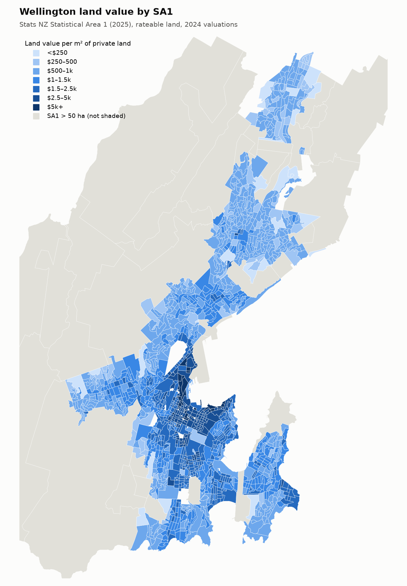
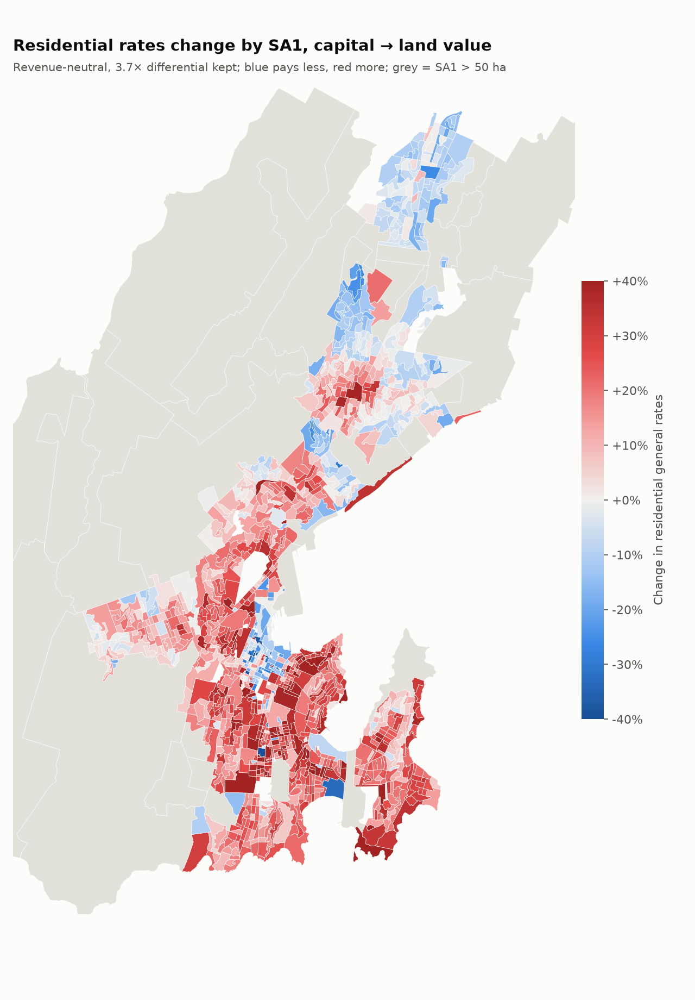
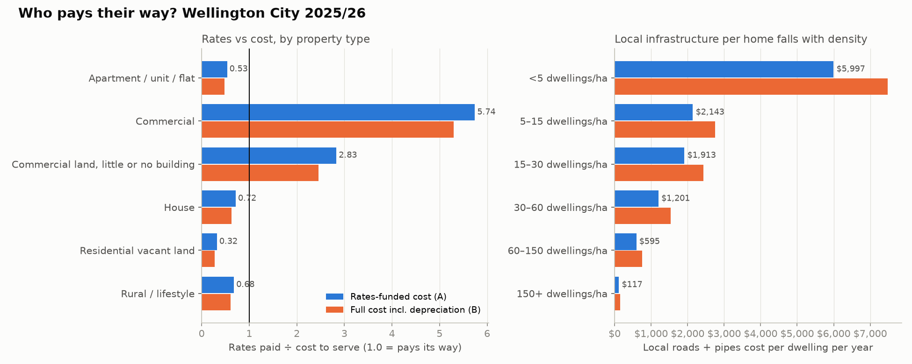
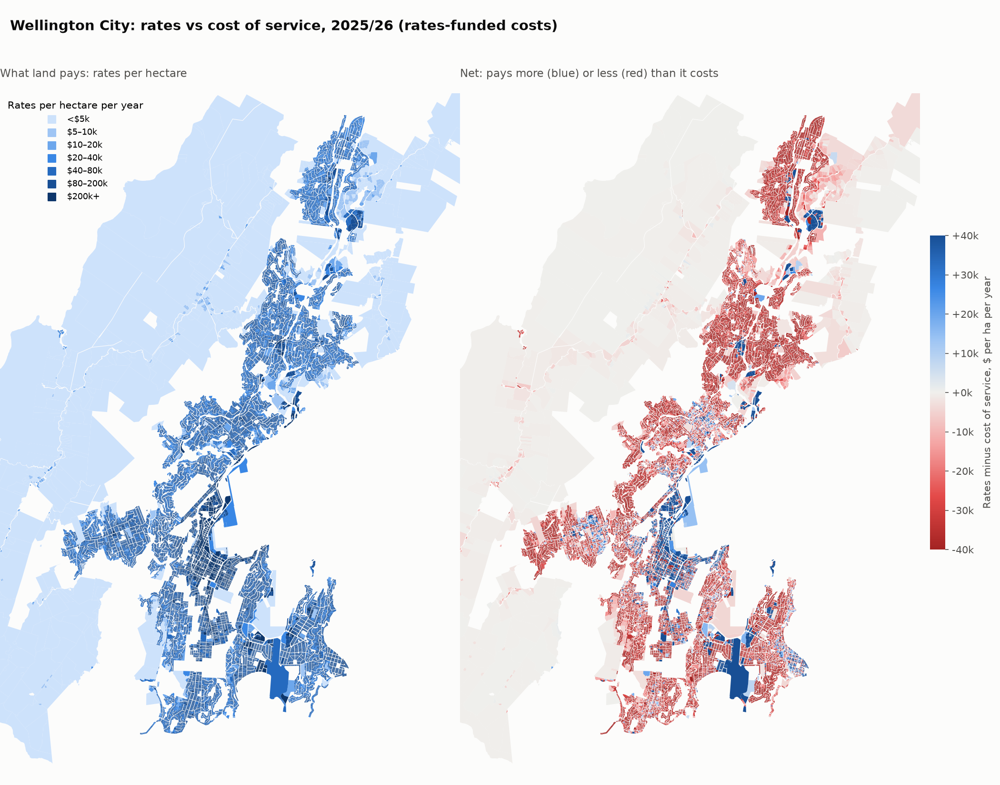
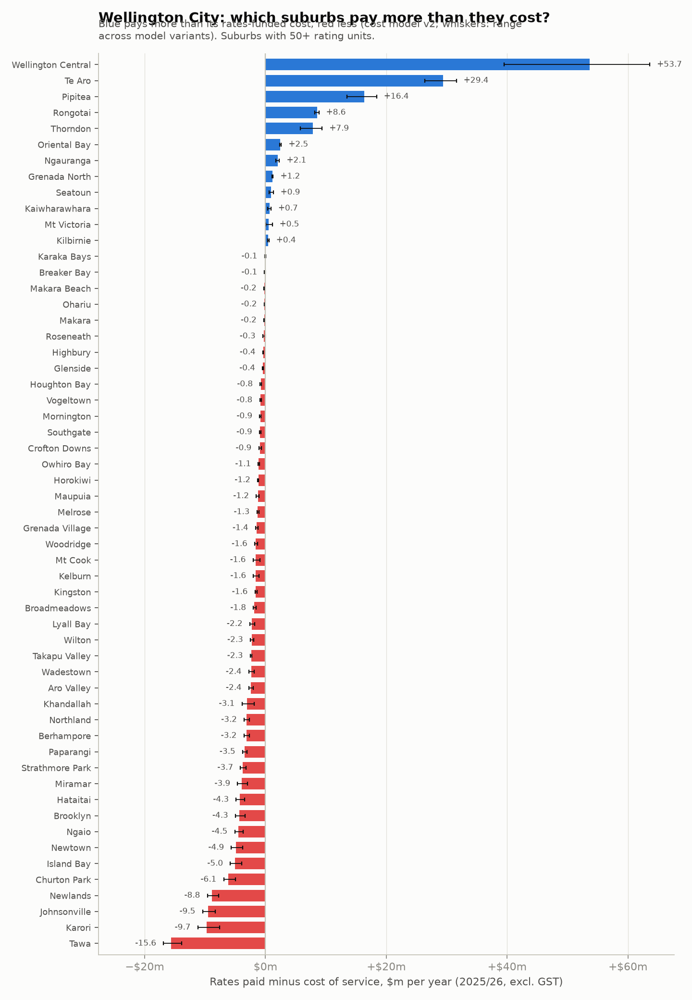
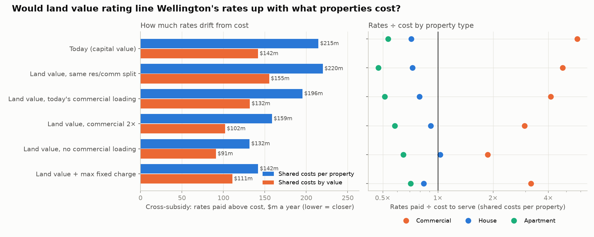
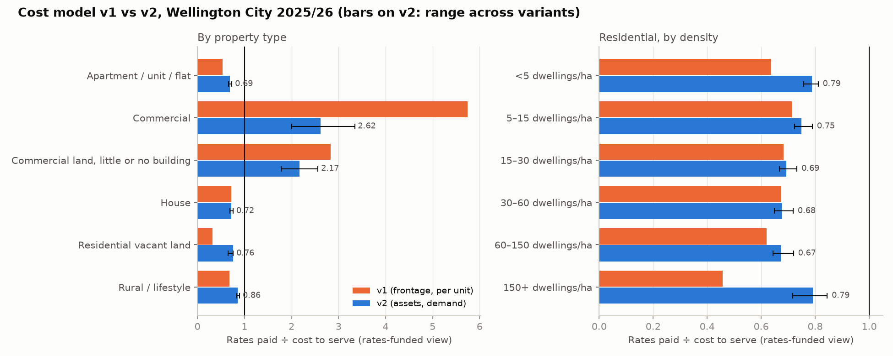

# Wellington City: what if rates were set on land value?

A parcel-level model of moving Wellington City Council's **general rate** from capital
value (CV) to land value (LV), using the council's own public valuation roll. It follows
the approach Lars Doucet and the Center for Land Economics use for US cities
([*Does Georgism Work? Five Years Later*](https://www.astralcodexten.com/p/does-georgism-work-five-years-later)),
adapted to New Zealand's rating system.

This matters now: in 2026 the council agreed to **consult on switching from capital value
to land value rating** (and on reducing its 3.7× commercial differential) for the
2027–37 Long-term Plan.

## Headline findings

All scenarios raise the same general-rate revenue as today (about **$396m** modelled on
82,313 rateable units). Targeted rates (water, sewerage, stormwater, downtown levy) are unchanged
and excluded.

| Scenario | Commercial share of general rate | Median house | Median apartment / unit | Vacant land & low-improvement sites |
|---|---|---|---|---|
| **Today**: CV, commercial pays 3.7× | 42.7% | $3,000 | $1,779 | $23.6m |
| LV, keep 3.7× | 36.4% | $3,315 (+11%) | $1,612 (−11%) | $46.5m |
| LV, residential/commercial revenue split held | 42.7% | $2,989 (0%) | $1,454 (−19%) | $52.3m |
| LV, differential cut to 2.0× | 23.6% | $3,981 | $1,936 | $34.7m |
| LV, no differential | 13.4% | $4,514 | $2,196 | $25.2m |
| CV, differential cut to 2.0× (for comparison) | 28.7% | $3,731 | $2,212 | $18.2m |

1. **Land is a big deal in Wellington.** Land is 54% of the rateable capital value
   ($48.6bn of $90.4bn), and 56% for residential property.
2. **Vacant land and land-banked sites roughly double their rates** under every LV
   scenario. The 706 commercial sites with little or no building (surface car parks,
   cleared lots, quake-prone buildings valued at nil) go from about $19m to $38m. This
   is the incentive Georgists want: holding well-located land empty gets more expensive.
3. **Apartments are the clearest winners.** They sit on small land shares, so their
   bills fall 11–19%. Te Aro and Pipitea homeowners see median falls of 27–30%.
4. **Older, land-rich suburbs pay more; newer northern suburbs pay less.** Houses in
   Newtown, Berhampore, Kelburn, Hataitai, Kilbirnie and Seatoun (land is over 60% of
   value) rise 24–31% under "LV, keep 3.7×". Churton Park, Tawa, Grenada North and
   Broadmeadows (land about 45%) fall 10–16%. The split follows each suburb's land share.
5. **Keeping the 3.7× commercial differential while moving to LV shifts about $25m
   a year from commercial ratepayers to residential ones.** Built commercial property
   pays $44m less and commercial land with little or no building pays $19m more.
   Commercial value is 43% land compared with 56% for residential, so taxing land cuts
   the commercial base. That is what pushes the median
   house up 11%. If the council holds each sector's revenue share constant instead, the
   median house is unchanged and 58% of homes pay less.
   **The rating base and the differential cannot be decided separately:** cutting the
   differential on top of an LV switch compounds the shift onto homeowners.
6. **This differs from the US results.** Doucet reports that the median single-family
   homeowner usually wins under a US land value tax shift. In Wellington the median
   house wins only if the commercial/residential split is held. Wellington already taxes
   commercial property heavily, and much of its housing is old, cheap-to-rebuild buildings
   on expensive land.
7. **The land values look fit for purpose.** Doucet's Baltimore report found vacant lots
   valued at about a tenth of the land value per m² of the improved lot next door.
   Wellington doesn't show that. Across 1,701 vacant lots compared with same-zone,
   similar-size improved neighbours within 300 m:
   - Vacant commercial land is valued at a median **1.01×** its neighbours' land $/m².
   - Vacant residential land is valued at 0.89× (many of those sections are steep or
     access-only).
   - Only 10% of vacant commercial lots fall below half their neighbours' rate.

## Figures


| | |
|---|---|
|  |  |

Tables behind every number are in [`outputs/tables/`](outputs/tables/).

## Land value and rates by block

`scripts/blocks.py` groups land into blocks: regular grids (100 m, 250 m,
500 m, 1 km), Stats NZ SA1s and SA2s, and SA2 × district plan zone "value districts".
It then answers two questions.

**1. How much land value, and how much land value rate, sits in each block?**
[`outputs/blocks/`](outputs/blocks/) has GeoJSON for the 250 m grid, the 500 m grid,
SA1s and SA2s, ready for QGIS or a web map. [`blocks_sa1.csv`](outputs/tables/blocks_sa1.csv)
and [`blocks_sa2.csv`](outputs/tables/blocks_sa2.csv) are the table versions. Each block has:
- land value per m² of private land, and per hectare of block (including roads);
- today's general-rate take;
- the take under land value rating (3.7× kept), both in total and per m² of land;
- the residential-only rates now and under land value rating;
- for SA1s only, 2023 Census residents, land value per resident, and residential rates
  per resident.

For example, Wellington Central land averages $6,022/m², which would carry about
$114/m² a year in general rates on land value. Mt Victoria North is $3,346/m² (about
$21/m² a year) and Grenada North $142/m² (about $1.40/m² a year).


**SA1s** are Stats NZ's smallest standard output areas. Wellington City has 1,401 SA1s,
each with a median of 42 parcels and 141 residents (2023 Census). At that resolution:
- **Most areas pay more.** Residential rates rise in 73% of SA1s, home to 71% of
  residents, when the 3.7× commercial differential is kept. That is mostly the ~$25m
  shift from commercial to residential ratepayers described above; holding the sector
  split would lower the bar everywhere.
- **Per resident**, the median SA1's residential general rate goes from $1,048 to $1,174.
- **The pattern repeats street by street.** Apartment blocks in Te Aro and Pipitea, and the
  newer subdivisions of Churton Park, Grenada and Tawa, pay less.
  Almost all of the older southern and eastern suburbs pay more.

| | |
|---|---|
|  |  |

**2. Could a council value land with one rate per block instead of parcel by parcel?**
This is the Qingdao and Somers approach Doucet describes: every parcel in a block gets
the same $/m², optionally adjusted for lot size.

The test works like this:
- Each urban parcel (≤ 2 ha, land value ≥ $50k) is valued with its block's rate,
  calculated *without* that parcel (leave-one-out), so no parcel sets its own value.
- The result is compared with its official 2024 land value using IAAO ratio-study
  statistics: COD measures how scattered the valuations are, and PRD measures whether
  they are fair between cheap and expensive land.
- About 2% of extreme ratios are trimmed.

| Blocks | Flat $/m²: COD | + lot-size adjustment: COD | Within ±20% | PRD |
|---|---|---|---|---|
| 100 m grid | 23.5 | **14.6** | 75% | 1.08 |
| SA1 | 25.7 | 15.9 | 72% | 1.12 |
| 250 m grid | 26.3 | 16.7 | 70% | 1.13 |
| 500 m grid | 27.9 | 18.5 | 66% | 1.18 |
| SA2 × zone | 29.2 | 19.3 | 64% | 1.17 |
| SA2 | 30.1 | 20.3 | 62% | 1.20 |
| 1 km grid | 30.6 | 20.9 | 61% | 1.22 |

IAAO targets are COD ≤ 15 for residential land (≤ 20 for vacant land) and PRD between
0.98 and 1.03.

- **Lot size matters more than block size.** Land $/m² falls roughly with the square
  root of lot area (slope about −0.5), so a large section is worth about 1.4× a section
  half its size, not 2×. Adding this one citywide adjustment cuts COD by about a third
  at every block size.
- **Small blocks with a size adjustment are nearly as good as parcel-by-parcel
  valuation:** 100 m blocks meet the IAAO residential COD standard. SA1s (COD 15.9) come
  close and beat a 250 m grid with a similar number of blocks, because their boundaries
  follow real neighbourhood edges (ridgelines, main roads, zone changes) rather than an
  arbitrary grid.
- **Coarse blocks are regressive.** PRD rises from 1.08 to 1.22 as blocks grow: modest
  land is over-valued and premium land (views, sun, frontage) under-valued within the
  block. A block-rate system would need small blocks, or a premium/discount layer, to
  avoid shifting rates onto cheaper sections.
- This compares block rates with QV's parcel mass appraisal, not with sale prices, so it
  measures how much parcel-level detail a block rate keeps. It isn't a test of market
  accuracy.

Full results, including how rates bills would differ, are in
[`blocks_valuation_accuracy.csv`](outputs/tables/blocks_valuation_accuracy.csv).


## Rates vs cost of service (Urban3-style)

[`scripts/fiscal.py`](scripts/fiscal.py) sets each property's estimated 2025/26 rates bill
against an estimate of what it costs the council to serve. It follows Urban3's "fiscal
productivity" method: local roads and pipes are charged to the properties they run past,
and shared costs are spread across everyone.

2025/26 is the last year water was billed in council rates (Tiaki Wai bills it from 1 July
2026), and the first year of the 2024 valuations. All figures exclude GST.

**Revenue: each rating unit's bill from the 2025/26 rates resolution.** It includes the
general rate, water, sewerage, stormwater, the sector rates and the downtown levy. The
modelled total is $611.8m, 97.5% of the actual $627.7m.

**Costs: two views.** Activity figures come from the LTP 2024-34 Amendment
([`fiscal_cost_pools_$m.csv`](outputs/tables/fiscal_cost_pools_$m.csv)).
- **A. Rates-funded:** what rates pay for today. Water $92m, wastewater $82m, stormwater
  $45m, transport $104m, and $261m for everything else (parks, libraries, recreation,
  governance, and so on).
- **B. Full cost:** operating cost + interest + depreciation, net of fees and subsidies.
  This is **$694m, about $82m a year (13%) more than rates raise.** The gap is mostly
  depreciation on the three waters that current rates don't cover: water rates cover
  about 78% of the full cost, wastewater 68% and stormwater 80%.

**How costs are allocated.** [`network_frontage.py`](scripts/network_frontage.py)
does the frontage matching. It uses the council's GIS: 709 km of council roads and
2,700 km of council pipes.
- **Local roads and pipes (up to 300 mm)** go to the properties on each side, in
  proportion to frontage. Pipe cost is weighted by diameter.
- **Trunk mains, treatment, arterial roads and other transport costs** are shared per
  rating unit. Trunk stormwater is shared by land area instead.
- **Everything else** is shared per rating unit.
- **The sector rates and downtown levy** are treated as funding that sector's own
  spending.
- **Frontage past parks and schools** is spread across all ratepayers.

| Property type | Rating units | Median rates | Local roads + pipes cost | Rates ÷ cost (A) | Rates ÷ cost (B) | A, shared costs by CV |
|---|---|---|---|---|---|---|
| House | 51,549 | $4,850 | $2,000 | 0.72 | 0.62 | 0.70 |
| Apartment / unit / flat | 25,814 | $3,070 | $460 | 0.53 | 0.48 | 0.91 |
| Commercial | 1,436 | $43,600 | $5,140 | **5.74** | 5.30 | 2.36 |
| Commercial land, little or no building | 706 | $20,400 | $4,510 | 2.83 | 2.46 | 1.94 |
| Residential vacant land | 2,322 | $2,460 | $2,400 | **0.32** | 0.28 | 0.42 |
| Rural / lifestyle | 486 | $5,970 | $5,290 | 0.68 | 0.61 | 0.53 |

"Local roads + pipes cost" is the average annual cost of the local network per unit.

1. **Commercial ratepayers carry the city.**
   - Commercial property pays $216m of rates against about $38m of allocated cost.
   - This is the 3.7× differential at work.
   - Even if shared costs are allocated by capital value, commercial still pays 2.4× its
     cost.
   - Residential property as a whole pays about two-thirds of what it costs to serve.
2. **Local infrastructure per home falls steeply with density.** Annual cost of local
   roads and pipes per dwelling:

   | Dwellings per hectare | Local network cost per dwelling (A) |
   |---|---|
   | under 5 | $6,000 |
   | 5–15 | $2,140 |
   | 15–30 | $1,910 |
   | 30–60 | $1,200 |
   | 60–150 | $595 |
   | 150+ | $117 |

   This is the classic Urban3 result: spread-out development needs far more road and
   pipe per household. Sparse suburban lots cost many times more to reach than
   apartments.
3. **Vacant residential land pays about a third of its cost.** It sits on serviced
   streets but pays rates on low capital value. Taxing land value instead of capital
   value (the rest of this analysis) would close most of that gap.
4. **Whether apartments "pay their way" depends on how shared services are split.**
   - Per rating unit (every household uses libraries and parks equally): apartments
     pay 0.53 of their cost, and inner-city SA2s such as Te Aro look subsidised.
   - By capital value: apartments pay 0.91, and 150+ dwellings/ha pays its way (1.08).
   - Either way, their *local infrastructure* cost is tiny.





The map shows rates per hectare (left, Urban3's "value per acre" in rates terms) and
rates minus cost of service per hectare (right). The CBD, Kilbirnie and Johnsonville
commercial centres and the airport pay well above their cost. Most residential land pays
less, because under the 3.7× differential commercial ratepayers fund much of the
residential share.

### Net by suburb and interactive map



The central city and commercial areas pay far more than they cost: Wellington Central
+$75m, Pipitea +$21m, Te Aro +$18m, Thorndon +$10m and Rongotai +$9m a year. The big
residential suburbs cost more than they pay: Tawa −$18m, Karori −$12m and Johnsonville
−$11m ([`fiscal_net_by_suburb.csv`](outputs/tables/fiscal_net_by_suburb.csv)).

[`scripts/fiscal_blocks.py`](scripts/fiscal_blocks.py) rolls the results up to SA1s
([`outputs/blocks/sa1_fiscal.geojson`](outputs/blocks/sa1_fiscal.geojson)).
[`scripts/build_web_map.py`](scripts/build_web_map.py) builds an interactive page
([`outputs/web/who_pays_wellington.html`](outputs/web/who_pays_wellington.html)) with a
map by SA1. It switches between net per hectare (rates-funded or full cost), rates and
cost per hectare, local infrastructure per home, land value per m², and the change under
land value rating. Clicking a suburb in the chart zooms the map to it.

### Would land value rating bring rates closer to cost?

[`scripts/lv_alignment.py`](scripts/lv_alignment.py) re-levies the same $612m under
land-value designs and measures how far each property's bill sits from its cost to serve
([`lv_alignment_per_unit.csv`](outputs/tables/lv_alignment_per_unit.csv),
[`lv_alignment_by_value.csv`](outputs/tables/lv_alignment_by_value.csv)).

**What "cross-subsidy" means here:** the total of rates paid above cost, which funds
others. Lower means rates track cost more closely. Each cell gives two figures: shared
costs split per property / split by value.

| Design (all raise the same total) | Cross-subsidy | Bills within ±25% of cost | House rates ÷ cost | Commercial rates ÷ cost |
|---|---|---|---|---|
| Today (capital value, commercial 3.4×) | $215m / $142m | 24% / 54% | 0.72 | 5.7 / 2.4 |
| Land value, same residential/commercial split | $220m / $155m | 24% / 44% | 0.73 | 4.8 / 2.0 |
| Land value, today's commercial loading | $196m / $132m | 29% / 52% | 0.79 | 4.1 / 1.7 |
| Land value, commercial 2× | $159m / $102m | 37% / 60% | 0.91 | 3.0 / 1.2 |
| Land value, no commercial loading | $132m / $91m | 43% / 59% | 1.03 | 1.9 / 0.8 |
| Land value + maximum fixed charge ($1,752, the 30% legal cap) | $142m / $111m | 46% / 59% | 0.84 | 3.2 / 1.3 |

- **Switching the base from capital value to land value barely moves the overall
  picture.** On its own it changes the cross-subsidy by −9% to +10%. The biggest
  mismatch is between commercial and residential, set by the commercial differential,
  not by which value is taxed.
- **The commercial differential is the main lever.** Land value with no commercial
  loading cuts the cross-subsidy by about 40% under either cost view.
- **A uniform fixed charge gets the most individual bills near their cost** (46% within
  ±25%), because much of the council's cost is per property.
- **Land value clearly helps where Doucet predicts: vacant and underused land.**
  - Vacant residential land goes from paying 0.32 of its cost to 0.53–0.75.
  - Commercial sites with little or no building start paying well above their
    frontage cost.
- **It doesn't help Tawa or apartments.**
  - Tawa's land is among the city's cheapest per m², so with the split unchanged its net
    goes from −$18m to −$21m.
  - Apartments sit on little land, so their bills fall further below cost.
  - Only a smaller commercial loading narrows Tawa's gap.



**Caveats**
- The cost split is a model, not the council's cost accounting.
  - Local vs trunk shares use length weights (trunk 2.5×, arterials 2×). Pipe cost
    rises with diameter by assumption, not from asset valuations.
  - Water use isn't measured per property: the commercial metered-water revenue is
    spread by capital value.
- The rating category (residential vs commercial) is the same proxy as the rest of this
  analysis.
- Non-rateable land (parks, schools, Crown land) gets network frontage, but its costs are
  spread over ratepayers.
- Per-unit sharing treats a studio apartment and a large office building as one
  "household" each for shared services. That is why the capital-value alternative is
  shown.

### Cost model v2: asset-based, calibrated, demand-based sharing

This version uses only public data (`network_v2.py`, `fiscal_v2.py`). The revenue side and
the activity cost totals are the same as v1. Only the way costs are assigned to
properties changes. It was built in two steps: v2a (the first four rows below), then
v2 (calibration and neighbourhood pooling).

| | v1 | v2 |
|---|---|---|
| Pipe cost | Length × a diameter factor (1.0 / 1.3 / 1.7) | Replacement cost (diameter unit rate) ÷ life (by material) × condition grade (0.8–1.5) |
| Water mains | Frontage | 31,800 service connections traced to their main and property; each main is split among the properties connected to it |
| Arterial roads | Arterials (2×) all shared; fronting lots pay nothing | Fronting lots pay the local-street equivalent. Width and traffic (category weight × ADT) above that is citywide |
| Trunk, treatment, other transport | Equal per rating unit | Person-equivalents: residents + 0.35 × workers (water, wastewater); trips: residents + 0.8 × workers (transport) |
| Stormwater trunk | Land area | Impervious area: roof + 20% (residential) or 60% (commercial) of the rest of the lot |
| Parks, libraries, community, governance… | Equal per rating unit | 81.6% by people (residents + 0.1 × workers), 18.4% per rating unit |
| Local vs trunk | Trunk weighted 2.5× per km | Each pipe's own weight, **calibrated to the council's asset valuation** (below) |
| Sharing local cost | Each lot's own frontage | **Pooled by SA1, split by lot width** (√area) |

Demand comes from the 2023 census:
- **Residents:** SA1 usually resident population, split over the homes in each SA1.
  This gives 201k residents on rateable homes.
- **Workers:** 2024 Stats NZ employee counts by SA2, spread over the floor area of
  commercial and non-rateable property. Floor area is building footprint × storeys, with
  storeys = height ÷ 3.3 m. This gives 135k jobs on rateable property; jobs on
  non-rateable land are left out.

**Calibration to council costs.** Each network's total is already the council's
activity cost, so scaling all pipes up by the same factor would change nothing. What
matters is the split between local pipes and everything else.
- **Replacement cost.** The GIS pipe inventory, priced at generic unit rates, comes to
  less than half the council's replacement cost (Annual Report 2024/25, Table 36).
- **Assets that aren't pipes.** Part of the gap is reservoirs, pump stations and
  tunnels. I priced these from the counts in the Infrastructure Strategy:
  - 68 reservoirs at $3m / $6m / $10m each (low / central / high);
  - water pump stations at $1m / $1.5m / $2.5m;
  - 69 wastewater pump stations at $1.5m / $2.5m / $4m;
  - 13.7 km of tunnels not in the GIS at $10k / $15k / $25k per metre.

  These count as trunk assets.
- **Pipes.** The remainder scales the pipe unit rates by k = 2.0 (water), 2.2
  (wastewater) and 1.5 (stormwater). That is consistent with hillside construction and
  with the valuation including fittings and laterals.
- **Depreciation check.** Implied depreciation matches the council's 2025/26 figures
  reasonably well:
  - water $29m, against $35m for the whole activity;
  - wastewater $37m, against $50m including the treatment plants (~$350m of plant);
  - stormwater $29m, against $23m (the council assumes longer stormwater lives).

  So the published useful lives (40–130 years) are consistent with the weights.
- **Effect.** Local pipes' share of network cost falls to 70% (water), 66%
  (wastewater) and 42% (stormwater). About $6m a year of water cost moves from fronting
  lots into the demand-based trunk pool (`outputs/tables/fiscal_v2_calibration.csv`).

**Frontage vs lot size.** Frontage says how much network a neighbourhood needs (street
length per home). But which particular lot fronts which pipe is mostly noise: corner
lots pay double, rear lots on a right-of-way pay nothing, and one lot can pick up a main
that serves the whole street. v2 therefore:
1. adds up each SA1's local roads and pipes (frontage + traced connections + pipes
   crossing private land);
2. splits that total among its parcels by lot width (√area), since the street length a
   lot needs grows with its width, not its area;
3. splits each parcel's share among its units by CV.

Lot area alone would overcharge big, steep hillside lots and parks. The share falling on
parks and schools is shared citywide. Own frontage, lot area and equal per unit are run
as variants.

Mean local roads + pipes cost per home, rates-funded
(`outputs/tables/fiscal_v2_local_cost_by_rule.csv`):

| Homes at… | Own frontage | SA1 pool, lot width (v2) | SA1 pool, lot area | SA1 pool, per unit |
|---|---|---|---|---|
| <5 /ha | $3,831 | $4,426 | $6,462 | $2,586 |
| 15–30 /ha | $1,555 | $1,507 | $1,226 | $1,598 |
| 60–150 /ha | $541 | $429 | $326 | $1,092 |
| 150+ /ha | $129 | $93 | $78 | $467 |

**Results (rates-funded view A; ratio = rates ÷ cost; range across all v2 variants in brackets):**

| | v1 | v2a | v2 |
|---|---|---|---|
| Commercial | 5.74 | 2.62 | **2.61** (1.98–3.36) |
| Commercial land, little building | 2.83 | 2.17 | 2.17 (1.77–2.58) |
| House | 0.72 | 0.72 | 0.72 (0.69–0.76) |
| Apartment / unit / flat | 0.54 | 0.69 | 0.69 (0.62–0.74) |
| Residential vacant land | 0.32 | 0.76 | 0.74 (0.63–0.79) |
| Homes at <5 dwellings/ha | 0.64 | 0.79 | 0.76 (0.65–0.89) |
| Homes at 150+ dwellings/ha | 0.46 | 0.79 | 0.79 (0.71–0.85) |
| Tawa (all property; net) | 0.56 (−$18.3m) | 0.60 | 0.60 (−$15.6m) |

The variants are:
- sharing by own frontage, lot area, or equally per unit;
- low or high non-pipe asset values;
- trunk pipes costing 1.5× more;
- worker weights halved or doubled;
- a 60% (not 81.6%) people share of other services.

The sharing rule matters most for the sparsest homes (0.65 by lot area to 0.89 per
unit). Worker weights matter most for commercial property.

**What changes from v1:**
- **Commercial still pays more than it costs, but by 2.6× not 5.7×.** v1 charged an
  office tower as one household for shared services. v2 charges it for the people who
  work there.
- **Apartments move towards paying their way (0.54 → 0.69).** They average 2.0 residents
  against 2.9 per house, so they use less of the people-based services.
- **The downtown gap mostly disappears.** Te Aro homes go from −$20m to −$3m, and
  Wellington Central and Pipitea come close to break-even.
- **Vacant residential land improves (0.32 → 0.74)** because it has no residents. It
  still has pipes and roads out front.
- **Houses and Tawa hardly move under any version or variant.** Their gap was never
  about the sharing rule or the calibration. It is the cost of the local network per
  household at 15–30 dwellings/ha, plus a general rate on CV that is low relative to
  that cost. The worst-off suburbs are still the northern ones (Paparangi, Grenada
  North, Kingston, Newlands, Tawa: 0.55–0.57).
- **Calibration and pooling barely move the aggregates, but they move individual
  properties a lot.** That is expected: they change who within a neighbourhood pays,
  not how much the neighbourhood costs.

Onslow examples (`python scripts/explain_property.py "Onslow Road" --v2`):

| Property | Rates | v1 cost | v2 cost (variant range) | Local roads + pipes: own frontage → v2 (SA1 pool by width) |
|---|---|---|---|---|
| 3 Onslow Rd (461 m²) | $4,344 | $6,975 | $6,718 ($5.6–7.0k) | $1,076 → $1,923 |
| 9C Onslow Rd (2,279 m²) | $4,213 | $8,125 | $9,473 ($7.1–9.7k) | $1,875 → $4,276 |
| 17C Onslow Rd (3,691 m², right-of-way) | $4,256 | $14,010 | $11,021 ($7.5–11.9k) | $5,187 → $5,441 |

Pooling spreads the Onslow SA1's expensive right-of-way pipes over the neighbourhood.
Bigger lots then carry more because they are wider, not because they happen to sit on a
main. The per-property shared charge falls from $5,033 (v1) to about $2,800, plus
$1,200–2,000 in demand-based trunk and treatment.

**Still not fixable from public data:**
- actual water consumption (commercial meters);
- the council's per-asset valuation (the calibration uses class totals);
- road structure costs (retaining walls, bridges) by location;
- true rating categories;
- where people actually live within unit-title buildings.



## Where should new cycle connections go?

This is a Propensity to Cycle Tool (PCT) style analysis. The scripts are, in order:
`fetch_cycling.py`, `cycle_network.py`, `cycle_model.py`, `cycle_validate.py`, `cycle_gaps.py`,
`cycle_priorities.py` and `build_cycle_map.py`. The outputs are the interactive map
`outputs/web/wellington_cycle_gaps.html` and the static map `outputs/figures/cycle_gaps.png`.
The research behind version 3, and the remaining steps, are in `CYCLING_IMPROVEMENT_PLAN.md`
(phases 0–5 are done).

**Method (version 3)**
1. **Trips.** 2023 Census main means of travel to work and to education, from SA2 of
   residence to SA2 of workplace or institution. This gives 97k work and 47k education
   commuters, excluding people who work or study at home. Where trips start and end:
   - homes, placed at properties by residents (scaled to each SA1's census count);
   - workplaces, placed at properties by estimated workers;
   - education trips, at OSM schools and universities.
2. **Network, rated per direction.** OSM streets and paths bikes may use are split at
   junctions. Each direction of each edge gets:
   - **Facility level:** one of track, protected lane, parallel path, segregated or shared
     path, shared footway, buffered/painted lane, bus lane, sharrow, or none. NZ drives on
     the left, so `cycleway:left` applies in the drawn direction and `cycleway:right` against
     it. This captures the transitional pattern of a protected uphill lane with sharrows
     downhill. 12.6 km of road differs by direction.
   - **Speed:** NZTA's National Speed Limit Register (98% of city road length), else OSM.
   - **Traffic:** council counts, NZTA state highway sites, else defaults by road class.
   - **Traffic stress (1–4):** a speed × volume × centre-line table (Furth LTS v2, UK LTN
     1/20, CROW, Auckland Transport's design code). 30 km/h streets under ~3,000
     vehicles/day are fine to share. One-way streets count 1.5× traffic. Descents over 4%
     on streets of 50 km/h or less rate one speed band lower.
   - **Paths beside motorway-like roads:** a shared path, footway or parallel path beside a
     road of 70 km/h+ or 20,000+ vehicles/day is separated but noisy and exposed, "a footpath
     next to a motorway". These rate level 2, not 1: 28 km, including 1.9 km of Aotea Quay's
     path and the Hutt Road paths beside SH1/SH2. Kerbed cycle tracks and protected lanes
     stay level 1.
   - **Crossing stress** at unsignalised junctions. Signals, or a zebra/marked crossing on
     roads of 50 km/h or less and 8,000 vehicles/day or less, count as level 2.
3. **Routing, calibrated against counters.** Cost = metres × stress factor + climb weight ×
   metres climbed + crossing penalty, × a roadside factor on paths beside motorway-like roads.
   The factors were fitted to WCC's VivaCity sensors:
   - Data: average weekday cyclists over the last 12 months, on days each sensor was up
     95%+ of the time, compared per camera.
   - Grid: 36 runs (stress × climb × roadside factor).
   - Best fit: level 3 streets cost 2.0× their length and level 4 streets
     3.0×, each metre climbed costs 30 m, busy unsignalised
     crossings add 30–80 m, and a path beside a motorway-like road costs 1.25× its length.
   - Fit improvement: agreement with the counts (log correlation, 105 sensors) rises
     from **0.48** with the first version's guessed factors to
     **0.60** (rank correlation 0.65).
   - The roadside factor is supported by the counts: at the best stress and climb settings,
     agreement is 0.56 without it (1.0), 0.60 at 1.25 and 0.58 at 1.5. Riders use Aotea Quay's
     path, but less than its directness would suggest.
   - Meaning: Wellington riders avoid busy roads and hills about twice as strongly as first
     assumed.
4. **Uptake.** The PCT's production Go Dutch model (2020 coefficients, gradient centred at
   0.78%), with e-bike terms. Each scenario is floored at people who already cycle the
   route, as in Scotland's NPT. The first version's 2017 model mixed in 2020 e-bike terms;
   that is fixed.
5. **Gaps.** A direction is a gap when it is level 3–4 (no protection) and carries 60+
   potential trips, on an edge with 250+ in total. Runs of the same street within 300 m
   form a corridor, ranked by potential cycle-km on its stressful directions.
6. **Crossing hotspots.** Junctions where potential trips arrive on low-stress streets and
   must cross a level 3–4 road without signals.

**Phase 3: demand (added 29 Sep 2026)**
- **School trips.** Education trips are split by destination using the Ministry of Education
  schools directory (type and roll; Eagle Technology's ArcGIS copy, because data.govt.nz blocks
  scripts).
  - School trips = 0.86 × roll. The 0.86 is education trips per enrolled pupil, measured in
    areas with no tertiary campus.
  - The rest are tertiary: 13.9k primary, 14.9k secondary, 18.4k tertiary.
  - Primary and secondary trips use the PCT schools models (Goodman et al. 2019), with Go
    Dutch applied within 5 km and 10 km respectively.
- **Shopping, visiting and leisure.** Added with Scotland's Network Planning Tool method:
  - Trip rates relative to commuting: shopping 1.08×, visiting 0.5×, leisure 0.27×.
  - A gravity model to OSM shops, cafés, parks, beaches, sport and attractions, and to other
    homes, between 0.5 and 15 km. Distance decay is fitted to UK trip-length ratios, giving
    mean trips of 3.3 km (shopping), 5.6 km (visiting) and 5.2 km (leisure).
  - Cycling today is assumed to equal the area's commute share (half that for shopping).
  - Return trips reuse the outbound route in reverse.
  - Adding these barely changes agreement with the counters (0.553 → 0.559), so they are
    assumptions the counts can't confirm.
- **A Wellington uptake model** (`cycle_uptake_fit.py`): a grouped binomial model on 2018 and
  2023 SA2-to-SA2 work trips (2,018 pair-years with 20+ commuters,
  9,111 cyclists), using calibrated route length, gradient, share on busy
  streets and share protected. Findings:
  - **Distance:** cycling peaks at 4–8 km (9.5% of those commuters). Shorter trips are walked.
  - **Hills:** no hill penalty in Wellington's census data (gradient
    +0.23, p 0.000). This reflects who cycles (committed riders, e-bikes), not
    the physics, so the hill effect can't be estimated from census shares.
  - **Protection:** share of route protected +0.45 (p 0.06); share on
    busy streets -0.27 (p 0.36). There's no detectable extra
    2018→2023 gain on now-protected routes; several opened after the March 2023 census.
  - **Scenario:** with Wellingtonians' current habits and every route made low-stress,
    commuter cycling on these pairs goes from 6.2% to
    7.1%, against
    20% under Go Dutch.
  - **Role:** the "Wellington habits" scenario is a cautious lower bound and Go Dutch the
    aspiration.

**Results**

| Trips | Trips/weekday | Mean km | Today | Go Dutch | E-bike | Wellington habits |
|---|---|---|---|---|---|---|
| work | 97,035 | 7.2 | 3.4% | 20.0% | 28.8% | 7.6% |
| primary | 13,941 | 3.0 | 2.3% | 15.1% | 15.1% | 2.3% |
| secondary | 14,868 | 5.0 | 0.9% | 47.1% | 47.1% | 0.9% |
| tertiary | 18,432 | 4.8 | 0.6% | 17.2% | 27.7% | 6.5% |
| shopping | 104,553 | 3.2 | 1.7% | 13.1% | 18.0% | 3.5% |
| visiting | 48,736 | 5.5 | 3.5% | 18.4% | 28.8% | 7.4% |
| leisure | 26,242 | 5.0 | 3.5% | 20.9% | 31.1% | 7.4% |
| all | 323,807 | 5.1 | 2.6% | 18.5% | 25.7% | 5.6% |

- **Where potential cycling would ride (Go Dutch, all trips):** 51% on protected routes, 27%
  on quiet streets, 22% on busy unprotected streets.
- **The ranking is robust to the uptake model:**
  - Go Dutch vs Wellington habits: rank correlation 0.92, and 13 of the top 20 are shared.
  - Go Dutch vs today's cycling: 11 of the top 20 are shared. Potential also points to the
    northern suburbs.
- **The safest bets** are in the top 25 on all three measures: Middleton Road, Willis Street, Victoria Street, Park Road, Newlands Road, Broadway, The Terrace, Rintoul Street, Riddiford Street, Daniell Street, Boulcott Street, Rongotai Road, Mein Street.
- **Top 20 vs the council's 2022 plan:**
  - 9 planned by the council;
  - 7 staged under LGWM, now unfunded (Willis, Victoria, The Terrace, Rintoul, Courtenay Place,
    Taranaki, Dixon);
  - 4 not in the plan: two stretches of Takapu Road (speculative: rural, 60–110 km/h, nobody
    cycles it today), Daniell Street and Boulcott Street.

| # | Street | Suburbs | Today | Go Dutch | Rank (Wellington habits) | Rank (today) | km/h | Vehicles/day | Facility now | Plan |
|---|---|---|---|---|---|---|---|---|---|---|
| 1 | Middleton Road | Glenside, Churton Park, Johnsonville | 59 | 1,575 | 1 | 8 | 50 | 6,985 | none | Planned (WCC) |
| 2 | Takapu Road | Tawa, Grenada North, Takapu Valley | 3 | 1,110 | 2 | 146 | 60 | 17,549 | none | Not in plan |
| 3 | Willis Street | Te Aro, Wellington Central, Aro Valley | 373 | 2,231 | 3 | 1 | 30 | 11,034 | none | Unfunded (ex-LGWM) |
| 4 | Victoria Street | Te Aro, Wellington Central, Mt Cook | 284 | 1,559 | 9 | 6 | 30 | 12,326 | sharrows | Unfunded (ex-LGWM) |
| 5 | Park Road | Miramar | 107 | 1,005 | 22 | 22 | 50 | 11,691 | none | Planned (WCC) |
| 6 | Burma Road | Broadmeadows, Khandallah, Johnsonville | 71 | 780 | 15 | 32 | 50 | 14,678 | none | Planned (WCC) |
| 7 | Newlands Road | Newlands | 100 | 785 | 5 | 19 | 50 | 15,669 | none | Planned (WCC) |
| 8 | Broadway | Strathmore Park, Miramar | 332 | 1,648 | 19 | 9 | 50 | 9,964 | none | Planned (WCC) |
| 9 | The Terrace | Wellington Central | 435 | 1,469 | 8 | 3 | 30 | 14,579 | none | Unfunded (ex-LGWM) |
| 10 | Rintoul Street | Newtown | 2,238 | 6,583 | 12 | 2 | 50 | 3,892 | sharrows (one way) | Unfunded (ex-LGWM) |
| 11 | Takapu Road | – | 1 | 1,514 | 45 | 219 | 110 | 500 | none | Not in plan |
| 12 | Riddiford Street | Newtown | 342 | 1,801 | 21 | 11 | 40 | 14,904 | none | Planned (WCC) |
| 13 | Daniell Street | Newtown | 309 | 1,467 | 18 | 10 | 40 | 5,000 | none | Not in plan |
| 14 | Helston Road | Johnsonville, Paparangi | 51 | 822 | 7 | 62 | 50 | 14,060 | none | Planned (WCC) |
| 15 | Courtenay Place | Te Aro | 217 | 1,188 | 28 | 14 | 30 | 8,700 | bus lane | Unfunded (ex-LGWM) |
| 16 | Willowbank Road | Tawa | 60 | 1,863 | 4 | 118 | 50 | 4,184 | none | Planned (WCC) |
| 17 | Boulcott Street | Wellington Central, Mt Victoria, Kelburn | 355 | 1,586 | 17 | 12 | 30 | 7,268 | none | Not in plan |
| 18 | Taranaki Street | Te Aro, Wellington Central | 70 | 1,003 | 43 | 66 | 50 | 15,000 | none | Unfunded (ex-LGWM) |
| 19 | Dixon Street | Te Aro | 241 | 1,434 | 31 | 26 | 30 | 5,000 | none | Unfunded (ex-LGWM) |
| 20 | Rongotai Road | Kilbirnie | 532 | 3,078 | 23 | 24 | 30 | 8,079 | sharrows | Planned (WCC) |

**Phase 4–5: what to build first (`cycle_priorities.py`)**

The gap ranking above says where potential riders meet traffic. It doesn't say which fix joins
up the most trips per dollar. The prioritisation does, in these steps:

- **Homes and jobs at property level.** Trips start and end at rating units (residents and
  workers from the v2 cost model, scaled to each SA1's census count), not one centroid per SA1.
  The first version snapped whole SA1s to single street corners. That made short links next to
  those corners look vital: Wha Street (Lyall Bay) and Ellice Street (Mt Victoria) were first
  and second on the list, and with homes spread along their streets they connect no trips.
- **Connectivity.** A trip is *connected* when its low-stress route (stress 1–2, ending at
  crossings of stress 1–2) is at most 25% longer than its shortest route (Furth, Mekuria &
  Nixon). The first and last 150 m may be on any street.
- **Today:** 37% of potential (Go Dutch) trips are connected, as are 38% of trips cycled
  today. That rises to 45% with a 50% detour allowed, and 52% if 150 m of busy street is
  tolerated.
- **Candidates:** 318 in total.
  - The 150 biggest corridor gaps (any level 3–4 direction with 30+ Go Dutch trips). Each
    covers the street's whole busy stretch: busy pieces within 150 m with few potential trips
    are filled in, so a Tinakori Road project leaves no busy gaps.
  - 88 unbuilt council-plan links (Strategic Bike Network: planned, ex-LGWM, desired) with a
    busy direction, whatever their modelled trips. A one-way street on the plan becomes two-way
    for bikes. For example, Bunny Street would carry the Thorndon Quay cycleway to the
    waterfront at Lady Elizabeth Lane both ways; today bikes may only ride it eastbound.
  - The 80 busiest unsignalised crossings of busy roads.
- **Treatments.**
  - Quiet street (30 km/h and a modal filter): local or collector roads of 50 km/h or less
    with 3,000 vehicles/day or fewer.
  - Protected lane: other roads.
  - Crossings: signals over 8,000 vehicles/day or 50 km/h, otherwise a raised zebra or refuge.
- **Benefit, exact.** Each candidate is added to the low-stress network and the trips newly
  connected are counted with an exact shortcut: new distance = min(old, via the tail of any
  new arc).
- **Network bonus, a judgment.** The score is trips per $M × 1.5 when both ends of a
  corridor join the existing cycle network, or × 1.25 for one end. The existing network is
  protected lanes, tracks, paths, living streets and the waterfront. The bonus stands for what
  the trip model misses: a legible, continuous network, and riders who would go further on
  it. The Monte Carlo draws vary it from 0 to ×1.5. A second ranking by trips connected, cost
  aside, is also reported.
- **Costs are indicative, not engineers' estimates.**
  - Quiet street: $0.1–0.3M/km, at least $30–100k a project.
  - Protected lane: $0.75M/km (Wellington transitional, 2023) to $3.4M/km (permanent), central
    $1.6M; ×0.6 when only one direction needs it; at least $0.1–0.5M a project.
  - Crossings: signals $0.5–1.5M; raised zebra $0.15–0.4M.
- **Health value:** NZTA MBCM $4.90 per new cyclist-km, on the extra cycling of newly
  connected trips. Low = Wellington habits, high = Go Dutch. Not an NZTA benefit–cost ratio.

**Build order** (greedy on the score, re-scoring after each step):

| Step | Project | Treatment | Cost | Go Dutch trips newly connected | Joins network | % connected after |
|---|---|---|---|---|---|---|
| – | Today | | | | | 37.2% |
| 1 | Bolton Street, Kelburn–CBD | Quiet street | $75k | 159 | one end | 37.5% |
| 2 | Panama Street, CBD (council plan) | Quiet street | $50k | 126 | – | 37.7% |
| 3 | Moorefield Road, Johnsonville | Protected lane | $250k | 371 | both | 38.3% |
| 4 | Oxford Street, Tawa | Quiet street | $60k | 119 | – | 38.5% |
| 5 | Duncan Street | Quiet street | $70k | 117 | one end | 38.7% |
| 6 | Chaytor Street, Karori–Kelburn | Protected lane | $580k | 746 | both | 39.9% |
| 7 | Garden Road, Northland | Quiet street | $85k | 82 | one end | 40.1% |
| 8 | Stone Street, Miramar | Quiet street | $60k | 70 | – | 40.2% |
| 9 | Cockayne Road at Lucknow Terrace, Khandallah | Raised zebra | $250k | 278 | – | 40.7% |
| 10 | Maupuia Road | Quiet street | $125k | 109 | one end | 40.9% |

What this shows:
- **Cheap fixes come first.** About $1.6M (indicative) lifts connected trips from 37% to 41%.
  Most are quiet-street treatments on short local links between low-stress areas.
- **Robust picks:** Bolton Street, Panama Street, Moorefield Road and Chaytor Street are in the
  top 10 in 80%+ of 1,000 draws of detour limit, scenario, cost and network bonus. Chaytor
  Street (Karori to Kelburn, 740 trips for about $0.6M) stays in the top 15 even when short
  busy stretches are tolerated.
- **Most trips connected, cost aside:**

  | Project | Trips per weekday | Indicative cost | Plan status |
  |---|---|---|---|
  | The Terrace | 1,089 | $2.9M | unfunded (ex-LGWM) |
  | Willis Street | 944 | $2.0M | unfunded (ex-LGWM) |
  | Chaytor Street | 739 | $0.6M | unfunded (ex-LGWM) |
  | Takapu Road | 592 | $1.0M | not in plan |
  | Para Street, Miramar | 527 | $0.9M | not in plan |
  | Broderick Road | 487 | $1.5M | planned |
  | Lambton Quay | 470 | $2.4M | unfunded (ex-LGWM) |
- **Bunny Street** (two-way, joining Thorndon Quay to the waterfront) ranks 25th on value (118
  trips, about $0.44M) and 36th on trips. The model credits only trips that have no
  low-stress route within 25% today. The built protected lane on Waterloo Quay already gives
  many waterfront–Thorndon trips such a route. Its network value (a continuous Thorndon–waterfront spine) is what the bonus
  tries to capture, and a trip model understates it.
- **Tolerance matters for the cheap fixes.** If 150 m of busy street is tolerated, 5 of the top
  10 stay in the top 10; at 400 m, 1 of 10 stays.
- **Crash flag:** CAS bicycle crashes since 2016 within 30 m of each project, shown on the map
  (not a weight).
- **Takapu Road is speculative.** It is a 110 km/h rural stretch (per the speed register) that
  nobody cycles today.

Outputs: `outputs/tables/cycle_priorities.csv` (every candidate: source, treatment, cost range,
trips newly connected by scenario, cycle-km, trips per $M, network ends joined, score, health
value, crashes, plan status, rank band, rank by trips, tolerance ranks, build step),
`cycle_build_order.csv`, `cycle_connectivity.csv` and the map's "Priorities" view (rank by best
value or most trips).

**Limitations**
- **Connectivity counts outbound trips.** Return trips roughly double them, but
  one-way streets can differ.
- **Crossing stress is per junction, not per turn.** A left turn onto a busy road counts as a
  crossing, which is conservative. Ignoring crossings adds 2–5 points of connectivity.
- **The build order tests candidates one at a time.** It re-scores after each step, but it
  doesn't test pairs of adjacent links that only pay off together.
- **Calibration predates property-level homes.** The route-choice factors were fitted with SA1
  centroids and not refitted.
- **Non-commute trips are modelled from UK travel-survey ratios**, not measured in
  Wellington; the counters can't confirm them.
- **Counts are below the modelled flows at matched sites.** Some countlines see only one
  side of a corridor.
- **The Go Dutch models are English/Dutch.** The Wellington-fitted model can't separate hill
  effects from who chooses to cycle.
- **OSM tagging drives facility levels.** Untagged cycleways are treated as shared paths.
- **Crossing stress uses nearby signal and crossing nodes, not turn geometry.**
- **The ranking is a long list for engineering assessment, not a design.**

## Data

| Source | What | Notes |
|---|---|---|
| WCC `PropertyAndBoundaries/Property` (public ArcGIS layer) | 88,070 rating-unit records with capital, land and improvements value | Valuation date 1 Sept 2024, used for rates from 1 July 2025 |
| WCC 2024 District Plan zones | Operative zones | Used for the commercial and non-rateable proxies |
| Stats NZ SA2 2025 (via WCC GIS) | 86 Wellington City statistical areas | Used for block aggregation |
| Stats NZ SA1 2025 + 2023 Census usually resident population (Stats NZ ArcGIS) | 1,401 SA1s in Wellington City | SA1 blocks and per-resident figures |
| WCC 2025/26 Rating Policy | General rate on CV, no UAGC, 3.7× commercial and 5× downtown vacant/derelict differentials | Base rate 0.301493 c/$ incl. GST |

## Method

1. **Deduplicate.** Drop 4,049 zero-value parent records (their value sits on unit-title
   and cross-lease children). Drop 720 valued parents whose portions (e.g. "COMMERCIAL
   PORTION" / "RESIDENTIAL PORTION") sum to the parent; keeping both would double count
   $6.5bn.
2. **Remove probably non-rateable land.** Drop the open space, town belt, hospital,
   tertiary and corrections zones, plus schools, churches, Parliament grounds and marae
   (identified from legal descriptions).
3. **Assign a proxy rating category.** The public layer has no differential category, so:
   - A unit is **Commercial** if it sits in a centre, mixed-use, industrial, port,
     airport or waterfront zone, unless it looks like a dwelling (a unit title ≤ $1.5m CV,
     or a non-unit property < $2m CV with a building).
   - Portion labels override the zone rule.
   - This gives commercial 16.7% of CV, against the ~15% Business Central quotes for
     2025/26. Implied commercial share of the general rate is 42.7%, consistent with the
     48% of *total* rates (including commercial-only targeted rates) reported for 2025/26.
4. **Model the scenarios.** Each scenario sets the rate in the dollar so total general-rate
   revenue is unchanged, then compares each unit's bill with today's.
5. **Check horizontal uniformity.** Compare each vacant lot's land value per m² with the
   median of improved neighbours in the same zone, within 300 m, and at 0.5–2× its area.

### Sensitivity

The headline results barely move when the residential/commercial thresholds change:

| Unit / house CV thresholds | Commercial share of CV | Median house (LV, 3.7×) | Median house (split held) | Median apartment (LV, 3.7×) |
|---|---|---|---|---|
| $1.0m / $1.5m | 17.8% | +10.7% | −0.4% | −10.4% |
| $1.5m / $2.0m (used) | 16.7% | +10.6% | −0.2% | −10.7% |
| $2.5m / $3.0m | 15.8% | +11.0% | −0.3% | −10.5% |

### Limitations

- **The rating category is a proxy.** The council's rating information database has the
  real category for every unit; requesting it would remove the biggest source of error.
- **Rateability is a proxy.** The model covers $90.4bn of CV against QV's published
  rateable total of $98.8bn. The gap is probably utility networks (which have no parcel)
  plus units the proxy wrongly excludes.
- **The 5× downtown vacant/derelict differential isn't modelled.** It is small and needs
  a council list of affected sites. Those sites are rated at 3.7× here.
- **Only the general rate is modelled.** Targeted rates would stay on capital value unless
  the council also changes them.
- **This is a static model with no behavioural response.** It shows who pays what on
  today's valuations, not the development response a land value rate is meant to cause.

## Reproduce

```bash
pip install -r ../requirements.txt
python scripts/fetch_data.py      # ~100 MB from gis.wcc.govt.nz into data/raw/
python scripts/build_dataset.py   # data/processed/units.parquet
python scripts/model.py           # outputs/tables/*.csv, data/processed/results.parquet
python scripts/uniformity.py      # outputs/tables/uniformity_*.csv
python scripts/figures.py         # outputs/figures/*.png
python scripts/blocks.py          # outputs/blocks/*.geojson, outputs/tables/blocks_*.csv
python scripts/fetch_networks.py  # roads, three-waters pipes, downtown levy area
python scripts/network_frontage.py
python scripts/fiscal.py          # outputs/tables/fiscal_*.csv, outputs/figures/fiscal_*.png
python scripts/fiscal_blocks.py   # SA1 GeoJSON, net by suburb table + chart (v2 costs, v1 + variant ranges kept)
python scripts/build_web_map.py   # outputs/web/who_pays_wellington.html
python scripts/lv_alignment.py    # land value rating vs cost-of-service alignment
python scripts/explain_property.py "Onslow Road" --type House   # line-by-line rates and cost for matching addresses
python scripts/network_v2.py      # v2: asset-weighted pipes, traced water connections, road reserve test
python scripts/fiscal_v2.py       # v2: calibration, SA1 pooling, demand-based sharing + variants
python scripts/explain_property.py "Onslow Road" --type House --v2
python scripts/fetch_cycling.py   # OSM streets/paths, WCC LiDAR DEM, bike plan, census travel OD
python scripts/cycle_network.py   # direction-aware network: facilities, speeds, traffic stress, crossings
python scripts/fetch_cycling.py --extras  # NZTA speed limits + SH traffic, OSM signals, WCC sensor counts
python scripts/cycle_validate.py  # calibrate route choice against sensor counts (~30 min)
python scripts/cycle_uptake_fit.py  # Wellington uptake model (2018 + 2023 census), writes cycle_uptake_local.json
python scripts/cycle_model.py     # all trip streams, Go Dutch / e-bike / Wellington-habits potential (uses calibration)
python scripts/cycle_gaps.py      # gap corridors vs council plan; map data and figure
python scripts/cycle_priorities.py  # connectivity, candidate treatments and costs, build order (~8 min)
python scripts/build_cycle_map.py # outputs/web/wellington_cycle_gaps.html   # incl. local cost under each sharing rule
```

## Possible next steps

- Get the council's rating information database with differential categories and
  rateability flags, and rerun.
- Model a phased transition (e.g. 25% LV per year) and hardship options for land-rich,
  low-income owners (e.g. rates postponement).
- Test **split-rate** options (e.g. 70% LV / 30% CV) alongside the all-or-nothing
  scenarios.
- Repeat for Hutt City, Porirua and Auckland. Auckland's 2012 amalgamation moved
  legacy council areas onto a single capital value basis, which may give a natural
  experiment for development effects (check which legacy areas were on LV).
